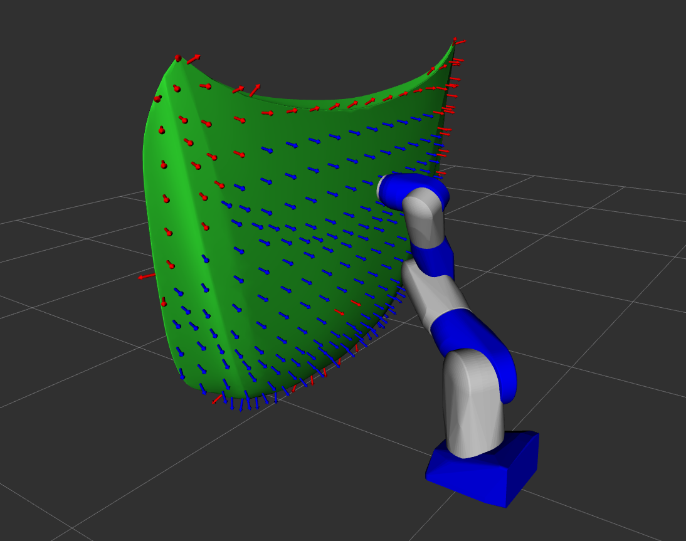

# REACH Demo



This package provides a demonstration of the REACH capability for an arbitrary robot work cell setup.

## Demo

Run the demo and view the pre-calculated results:
```
roslaunch reach_core setup.launch robot:=`rospack find reach_ros`/launch/robot.launch
roslaunch reach_core start.launch config_file:=`rospack find reach_ros`/config/params.yaml config_name:=reach_study
```

> Note: the `config_name` parameter controls the name of the folder in which results are saved. By providing a name that already exists in the results
directory (specified in the `params.yaml` file), the study will load existing results from file rather than re-running the study. To re-run the study,
simply execute the commands above with a different `config_name` parameter.

## Study Notes

This study is more interesting than some because the robot has more than six degrees of freedom. This additional degree of freedom gives the robot "room" to improve
its solution for each target point relative to the input evaluation criteria.

We could make this reach study even more interesting by removing the constraint on tool orientation about the Z axis, thereby giving us one more degree of freedom
with which to improve robot poses at the target points. Your choice in IK solver or reach study IK plugin can help encode additional constraints (or lack thereof) into the reach study.
For example, an IK solver could be modified to allow some tolerance on the tool orientation. Constraints on the IK solving of target waypoints should either be implemented
in the IK solver itself or in a custom reach study IK solver plugin.

This demo uses a custom URDF, SRDF, `kinematics.yaml`, and `planning_context.launch` file for the sake of packaging the required files in one location.
You might choose to create separate packages for your robot model and MoveIt! configuration package, in which case the aforementioned files can be used directly from those packages.

The reach study target points for work piece in this reach study were sampled using the PCL mesh sampling tool:
```
pcl_mesh_sampling part.ply part.pcd -leaf_size 0.1 -write_normals true
```
